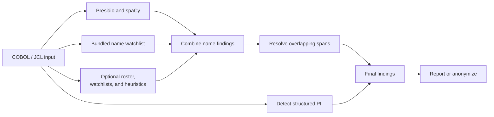
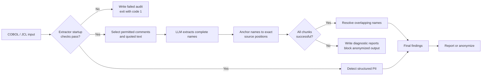
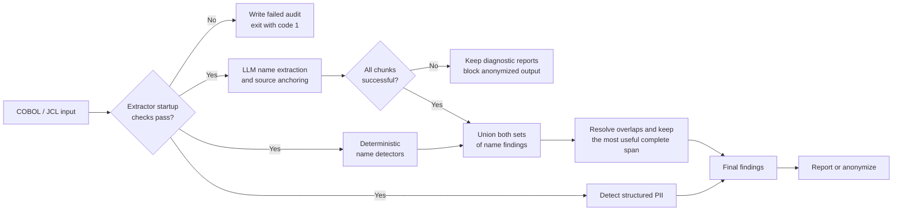
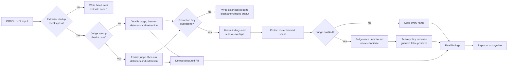

# Name Detection Modes

The selected mode changes how **person names** are handled. Structured private
data such as IBANs, fiscal codes, emails, phone numbers, and employee numbers is
always detected with the same deterministic rules.

There are two different LLM jobs:

- The **extractor** discovers names directly from permitted source text.
- The **judge** reviews names already found and may reject false positives.

## 1. Baseline



Baseline uses only deterministic detectors. Presidio/spaCy recognizes people
from language patterns, while watchlists and an optional employee roster match
known names directly.

It is the fastest and most repeatable mode and does not require Ollama. Its
main limitation is that it can miss names unknown to its model and lists.

```bash
python -m cobol_code_anonymizer INPUT
```

Baseline is the default, so it needs no mode flag.

## 2. Extraction Only



Extraction-only disables Presidio, the bundled and private name watchlists,
roster-based name matching, and unknown-name heuristics. The LLM extractor is
therefore the only component allowed to discover names. A supplied employee
roster can still classify numeric matricole; only its names are ignored.

The model sees only permitted line-bounded text, not arbitrary executable
COBOL. A returned name is accepted only when it can be matched back to its
exact position in the original source.

This mode is useful for measuring the extractor by itself. It is not the safest
production choice because a technically successful LLM response can still miss
a real name.

```bash
python -m cobol_code_anonymizer INPUT --llm
```

## 3. Union



Union runs the baseline detectors and the LLM extractor on the same source,
then combines their findings before resolving overlaps.

An exact duplicate keeps the deterministic finding. An extracted complete name
can replace a shorter partial finding when their spans overlap. This lets the
LLM improve name coverage without discarding reliable baseline results.

Union is the privacy-oriented production mode: it aims to miss as few names as
possible, but it can retain baseline false positives.

```bash
python -m cobol_code_anonymizer INPUT --union
```

## 4. Union Plus Judge



This mode first produces the same combined findings as union. The judge then
reviews the resolved name candidates; it does not search the source for new
names.

Roster-backed spans are never removed. Model errors and uncertain decisions
also keep the candidate. Under the active policy, only guarded rejections are
removed. If the judge fails its startup checks, it is disabled and the run
continues like ordinary union, keeping all names.

This mode can reduce false positives while preserving union's coverage. On the
current stress corpus it kept the same truth-name recall as union and removed
12 false-positive findings, making it the most accurate measured configuration
for that test.

```bash
python -m cobol_code_anonymizer INPUT --judge
```

## Quick Comparison

| Mode | Deterministic names | LLM extractor | Active judge | Main goal |
|---|---:|---:|---:|---|
| Baseline (no flag) | Yes | No | No | Speed and repeatability |
| `--llm` | No | Yes | No | Evaluate the extractor alone |
| `--union` | Yes | Yes | No | Maximum privacy-oriented recall |
| `--judge` | Yes | Yes | Yes | High recall with fewer false positives |

All four modes use the same replacement step after scanning: each finding is
shown with a suggestion, and the user can accept it, type a custom value, skip
it, accept all remaining suggestions, or skip all remaining findings.

Add `--explain` to any command to display how each name was handled. In union
mode it shows `LLM only`, `baseline only`, or `LLM + baseline agreement`. In
judge mode it also shows whether the judge kept, protected, was uncertain
about, or explicitly rejected a candidate. This option uses decisions already
made during the run, so it does not add LLM calls.

Each LLM mode writes `llm_name_review.csv` in its report/output folder. The
same file works across all modes:

| CSV value | Meaning |
|---|---|
| `agreement` | LLM extractor and baseline found the name |
| `extractor_only` | Only the LLM extractor found the name |
| `detector_only` | Only spaCy/watchlist/roster found it; this is not a rejection |
| `judge_status=reject` | The judge rejected the candidate |
| `final_action=removed_from_findings` | The rejection was applied; the text is left unchanged |
| `discarded_unlocatable` | LLM text could not be matched back to the source |

Two readable text files are created automatically:

- `scan_summary.txt` lists every detected name once, with total hits and all locations.
- `llm_finding.txt` groups LLM results by status and includes the action and reason.

In judge mode, `llm_finding.txt` has `KEEP`, `UNCERTAIN`, `PROTECTED`, and
`REJECT` sections. In union and extraction-only modes it reports extractor
evidence instead, because extraction absence is not a rejection decision.

## Copy-Paste Commands

Use the same command every time. Only change the final mode flag.

First choose your paths:

```bash
INPUT="/path/to/cobol-folder-or-file"
OUT="/path/to/anonymized"
TXT="/path/to/company_workers_or_names.txt"
```

`INPUT` can be one `.CBL` file or a folder with many COBOL files.

If your TXT is a company workers file, keep:

```bash
--employee-roster "$TXT"
```

If your TXT is only names or surnames, replace it with:

```bash
--watchlist "$TXT"
```

### Baseline

```bash
python3 -m cobol_code_anonymizer "$INPUT" \
  --employee-roster "$TXT" \
  --out-dir "$OUT/baseline" \
  --report-dir "$OUT/baseline/reports" \
  --auto
```

This anonymizes the COBOL files and creates the normal report:

```text
$OUT/baseline/reports/scan_summary.txt
```

### LLM Extraction Only

```bash
python3 -m cobol_code_anonymizer "$INPUT" \
  --employee-roster "$TXT" \
  --out-dir "$OUT/llm" \
  --report-dir "$OUT/llm/reports" \
  --llm \
  --auto
```

This is the same command as baseline, only with `--llm` added.

### Union

```bash
python3 -m cobol_code_anonymizer "$INPUT" \
  --employee-roster "$TXT" \
  --out-dir "$OUT/union" \
  --report-dir "$OUT/union/reports" \
  --union \
  --auto
```

This is the same command as baseline, only with `--union` added.

### Union Plus Judge

```bash
python3 -m cobol_code_anonymizer "$INPUT" \
  --employee-roster "$TXT" \
  --out-dir "$OUT/judge" \
  --report-dir "$OUT/judge/reports" \
  --judge \
  --auto
```

This is the same command as baseline, only with `--judge` added.

For LLM modes, the tool also creates:

```text
$OUT/llm/reports/llm_finding.txt
$OUT/llm/reports/llm_name_review.csv
$OUT/llm/reports/extraction_decisions.json
```

For `--union`, the files are in `$OUT/union/reports`. For `--judge`, they are
in `$OUT/judge/reports`.

During LLM runs, the terminal shows file progress, for example
`Analyzing file 3/42: PAYROLL.CBL`, so long runs do not look stuck.

If you do not have a TXT file, remove the `TXT=...` line and remove the
`--employee-roster "$TXT"` line from the command. Everything else stays the
same.

On Windows, use `python` instead of `python3`. PowerShell variables look like
`$INPUT = "C:\path\to\folder"` and can still be used as `$INPUT` in the same
commands.

`--auto` means the tool does not ask replacement questions. It uses automatic
replacement values.

## Replacement Map CSV

If you want to create a CSV mapping first:

```bash
python3 -m cobol_code_anonymizer "$INPUT" \
  --employee-roster "$TXT" \
  --create-map "$OUT/replacement_map.csv" \
  --report-dir "$OUT/reports"
```

Then anonymize later using that CSV:

```bash
python3 -m cobol_code_anonymizer "$INPUT" \
  --employee-roster "$TXT" \
  --map-file "$OUT/replacement_map.csv" \
  --out-dir "$OUT/anonymized" \
  --auto
```

For a plain name list, use `--watchlist "$TXT"` instead of
`--employee-roster "$TXT"`.

## Failure Rules

- An extractor startup failure stops the run and returns exit code `1`.
- An extraction chunk failure writes diagnostic reports but blocks mappings,
  prompts, and anonymized output.
- An unlocatable model response is discarded but does not fail the run.
- A judge startup failure disables the judge and keeps all name candidates.
- Structured PII detection is unchanged in every mode.

## Default Models

Change the defaults once in `cobol_code_anonymizer/llm.py`:

```python
NAME_EXTRACT_MODEL = "ministral-3:3b"
NAME_JUDGE_MODEL = "ministral-3:3b"
```

The two values are independent, so extraction and judging may use different
models without changing the mode commands.
